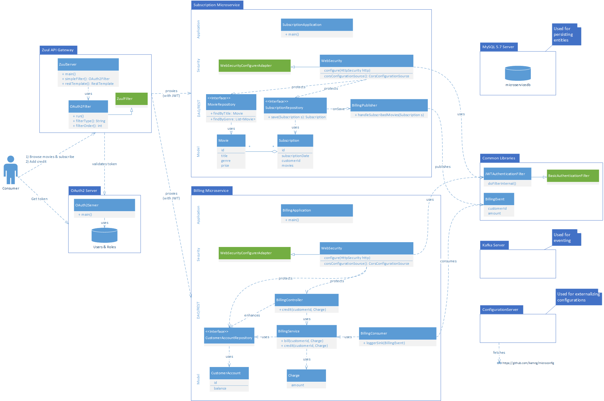

# microservices

## Overview
A simple microservice-based exercise using SpringBoot:

## Requirements
* Requires Docker, Java 8, and Maven
* At run-time, fetches configurations from [Configuration Github](https://github.com/liemng/microconfig)

## Build it!
`mvn clean package docker:build`

## Deploy it!
`docker-compose -f docker-infra.yml -f docker-app.yml up`

_Note_:
* This branch (zuul) uses the Netflix Zuul server for the API Gateway.  For the CA Layer7 API Gateway, use the main branch.
* Docker engine needs to have at least 4GB RAM reserved (more if you are running other stuff besides this).

## Shake it!
Switch to ./tests directory and run:

`newman run Microservices.postman_collection.json -ke microservices.postman_environment.json`

## Clean it up!
`docker-compose -f docker-infra.yml -f docker-app.yml down && docker rmi $(docker images | awk '$2~/microservices/{print $3}')`

## Hacking it!
The API Gateway and infrastructure containers need to be started on Docker:

`docker-compose -f docker-infra.yml`

The rest of the application, i.e., those in the `docker-app.yml` file can be run locally in your favorite IDE for debugging.

_Note_: For eventing, modify the `docker-infra.yml` for the Kafka server to advertise on localhost.
